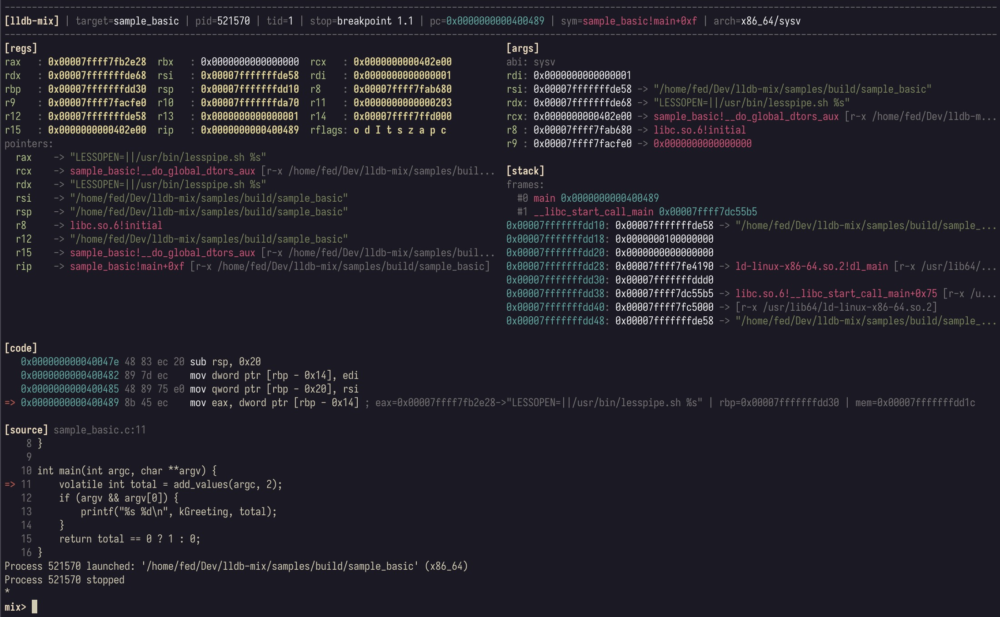

# lldb-mix

a modern, context-aware ui for binary-first debugging with **lldb**. inspired by [gef](https://github.com/hugsy/gef) and [lldbinit](https://github.com/gdbinit/lldbinit).



## install

```sh
python3 ./scripts/install.py
```

## quick start

```
lldb /path/to/bin
mix> context
```

## usage

```
context                       # show context once
conf list                     # list settings
conf get <key>                # show a setting
conf set <key> <value...>     # update a setting
conf set abi auto|sysv|win64|sysv32|win32|win32-cdecl|win32-stdcall|win32-fastcall|win32-thiscall|aapcs64|aapcs32|riscv|riscv-x  # override ABI selection (applies per-arch)
conf set lldb_formats on|off  # toggle lldb backtrace formatting
conf default                 # reset settings to defaults (not persisted)
conf save                     # persist settings (OS-specific config path)
conf load                     # load settings (OS-specific config path)
dump [addr|reg|sp|pc] [len]   # hexdump memory at address/register
db/dw/dd/dq [addr|reg|sp|pc] [len]  # word-sized dumps (byte/word/dword/qword)
u [addr|reg|pc] [count]       # disassemble instructions
findmem ...                   # search memory across regions
mixhelp [-v] [pattern]        # list lldb-mix commands
rr [args...]                  # run to entrypoint (stop at entry)
skip [count]                  # skip N instructions (default 1)
deref [addr|reg|expr] [-d n]  # explain an address via deref chain
patch ...                     # patch memory (write/nop/int3/null/restore/list)
ret [value]                   # return from current frame
watch add <expr> [label]      # add watch expression
watch list|del|clear          # manage watches
bp list|enable|disable|clear  # breakpoint management
sess save|load|list           # persist or restore watches/breakpoints
bpm <module> <offset>         # break at module base + offset
bpt <addr|expr>               # temporary breakpoint
bpn                           # temporary breakpoint at next instruction
regions                       # list process memory regions (alias: vmmap)
antidebug                     # enable anti-anti-debugging callbacks
```

## samples

build samples:
```
cmake -S samples -B samples/build
cmake --build samples/build
```

run lldb:
```
lldb samples/build/sample_basic
(lldb) command script import /path/to/lldb-mix/lldb_mix_loader.py
(lldb) breakpoint set -n main
(lldb) run
```

## dev

run unit and integration tests:
```
python3 -m unittest discover -s tests
```
